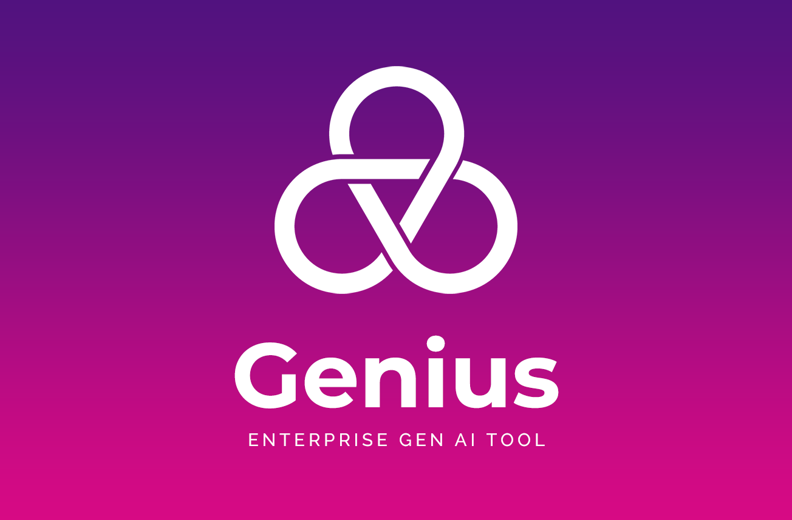
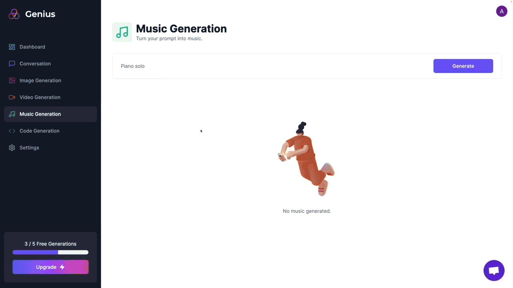
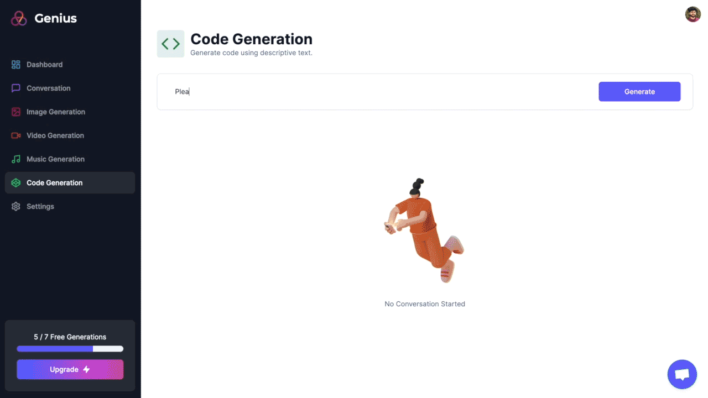
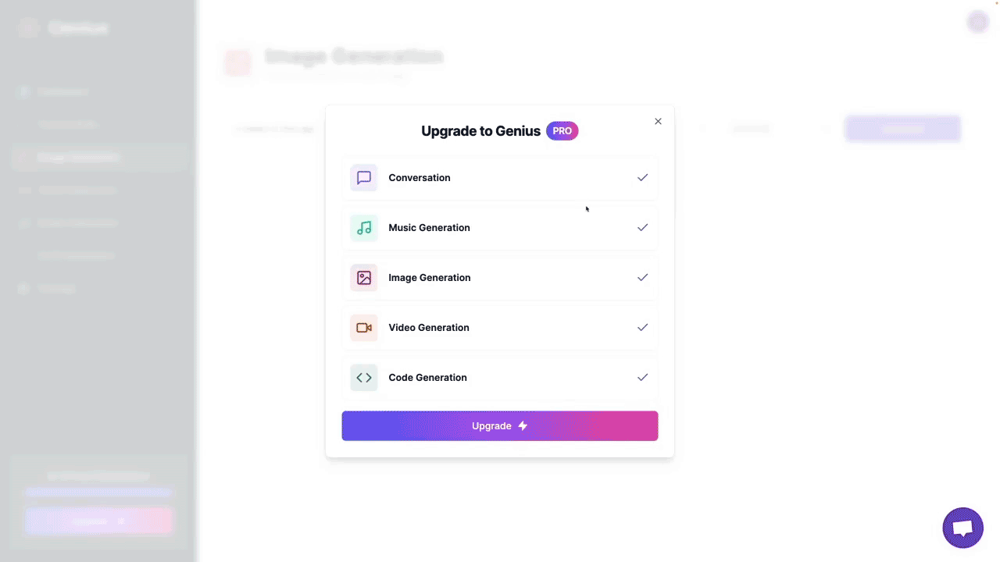
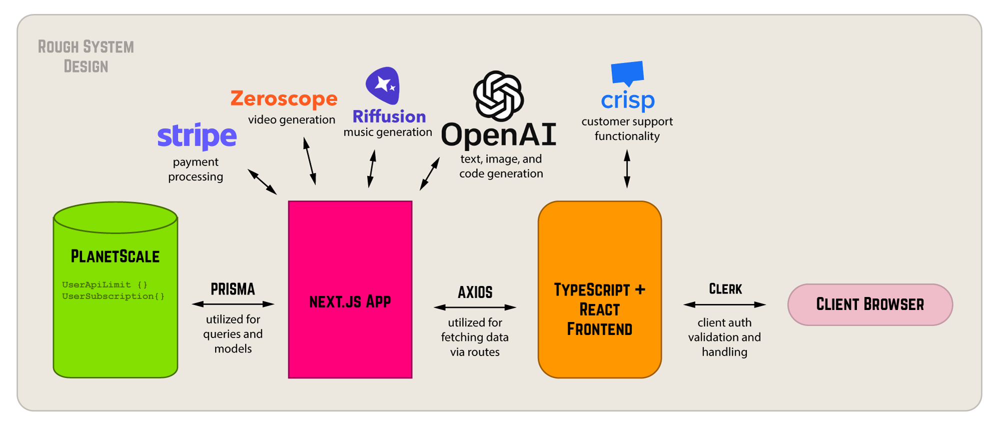

# Genius

An enterprise web application that offers ~5 generative AI algorithms for conversation, image, video, and music creation. Built with TypeScript, React, Next.js, Prisma, PlanetScale, Stripe API, OpenAI API, Riffusion, and Zeroscope. [Live Link](https://genius-navy-zeta.vercel.app/)<br/>
<br/>

<br/>

### Functionality

Genius allows a user to -
- Sign up and create an account.
- Enter email verification code.
- Get free trial of 7 AI generations. 
- Generate text, images, video, music, and code.
- Pay for Genius Pro via Stripe.
- Switch to Genius Pro and unlock more generations.
- Remain auto-logged in after sign-up/log-in.


### Demo

1. Sign In

<br/>

2. Conversation Generation

<br/>

3. Music Generation

<br/>

4. Image Generation

<br/>

5. Video Generation

<br/>


6. Code Generation

<br/>

7. Upgrade to Pro

<br/>

### System Design
<br/>


### Technologies Used

- TypeScript
- React
- Next.js
- Prisma
- PlanetScale
- Stripe API
- OpenAI API
- Riffusion
- Zeroscope

### How to Run Locally

Step 1 - Clone the repository in a new directory:
```bash
git clone https://github.com/sarthak-wadhawan/genius.git
```

Step 2 - Create .env file in root directory with the following info:
```bash
# Clerk with Next.js. Docs (clerk.com/docs/quickstarts/nextjs)
NEXT_PUBLIC_CLERK_PUBLISHABLE_KEY=
CLERK_SECRET_KEY=
NEXT_PUBLIC_CLERK_SIGN_IN_URL=/sign-in
NEXT_PUBLIC_CLERK_SIGN_UP_URL=/sign-up
NEXT_PUBLIC_CLERK_AFTER_SIGN_IN_URL=/dashboard
NEXT_PUBLIC_CLERK_AFTER_SIGN_UP_URL=/dashboard

# Open AI API Docs (platform.openai.com/docs/api-reference)
NEXT_PUBLIC_OPENAI_API_KEY=

# Replicate API Docs (replicate.com/docs)
REPLICATE_API_TOKEN=

# Connection string options with Prisma: https://pris.ly/d/connection-strings
# PlanetScale Docs (planetscale.com/docs)
DATABASE_URL=
NEXT_PUBLIC_APP_URL=

# Stripe needs an absolute url. Docs (stripe.com/docs/api) 
NEXT_PUBLIC_STRIPE_API_KEY=
STRIPE_WEBHOOK_SECRET=
```

Step 3 - Push DB Schema
```bash
npx prisma db push

```
Step 4 - Run app locally
```bash
npm run dev
```


